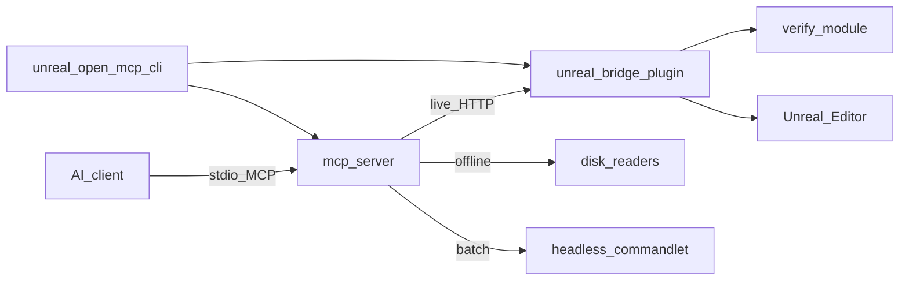

# Architecture

Unreal Open MCP has four runtime parts:

- **Unreal project** with bridge and verify plugins installed (`Plugins/UnrealOpenMCP/`).
- **Bridge** — C++ Editor module, loopback HTTP, game-thread dispatch.
- **MCP server** — TypeScript stdio server, tool registry, routing.
- **CLI** — install, setup-mcp, open, wait-for-ready.

A desktop **Hub** app for guided setup is planned but deferred.

## Repository map

- `mcp-server/` — MCP stdio server, tool registry, routing.
- `packages/bridge/` — Unreal HTTP bridge and typed tool handlers (shipped as `Plugins/UnrealOpenMCP/`).
- `packages/verify/` — validation rules and fixes used by gate flows (standalone; bridge depends on verify).
- `cli/` — `unreal-open-mcp-cli` command-line tooling.
- `skills/` — agent playbooks (`SKILL.md`).
- `demo/` — minimal Unreal C++ demo project with fixtures.
- `scripts/` — version sync and maintenance scripts.

## Runtime flow

1. AI client calls an MCP tool.
2. MCP server resolves the tool in the registry and dispatches it.
3. Call goes to:
   - the live bridge via `LiveClient` — `unreal_open_mcp_ping` routes to `GET /ping`; every other tool routes to `POST /tools/{name}` (the first typed tool, `unreal_open_mcp_actor_find`, shipped in P2.2), or
   - offline/local readers (supported tools, planned), or
   - local-only handlers (capabilities, manage_tools, planned).
4. Response is a structured MCP `CallToolResult`; live errors are classified into `bridge_offline` / `bridge_timeout` / `bridge_http_error` so callers can branch on cause.



## Route types

- `live` — Unreal Editor bridge is running and reachable.
- `offline` — disk readers for selected project/source operations (no editor required).
- `local` — no Unreal call required (catalog-style operations).
- `batch` — headless Unreal commandlet for supported read/compile operations (planned; narrower than Unity batch).

## Unreal-specific constraints

- Editor bridge is a **C++ Editor module** — no in-process .NET MCP host.
- All UObject / editor API calls run on the **game thread** via a dispatcher.
- Content paths use `/Game/...` and `/Engine/...`; C++ source is jailed to `<Project>/Source/`.
- v1 targets **UE 5.6+**; develop and CI against **UE 5.8**.
- Do **not** pin `EngineVersion` in `UnrealOpenMCP.uplugin` — document the floor in docs/CI only.

## Editor / Runtime boundary

Unreal separates editor and runtime modules at compile time:

- `UnrealOpenMcpEditor` — editor-only (HTTP bridge, tool handlers, gate wiring).
- `UnrealOpenMcpRuntime` — shared infra that may ship in packaged builds when explicitly opted in.
- `UnrealOpenMcpVerify` — editor-only health checks.

The load-bearing invariant is one-directional: **Editor code may reference Runtime code; Runtime code may NEVER reference Editor code.** ModuleRules enforce linking; the include/surface leak (e.g. a stray `#include "UnrealEd.h"` or an editor-only `Build.cs` dependency) is enforced by `scripts/check-editor-boundary.py`, which runs as a blocking CI guard (`editor-boundary` job). See `packages/bridge/AGENTS.md` for the run command and suppression policy.

## Verify module

`packages/verify/` is a standalone Editor plugin (`UnrealOpenMCPVerify.uplugin`) that owns the rule and fix contracts the gate flow (checkpoint → mutate → validate → delta) dispatches into. The load-bearing invariant is the reverse of the bridge's Editor→Runtime rule: **the bridge depends on verify; verify never depends on the bridge.** The `UnrealOpenMcpVerify.Build.cs` deliberately lists no `UnrealOpenMcp*` dependencies — verify must stay usable standalone so the MCP-side offline scanner can read its issue codes without a live editor, and so the gate (P3.5) can soft/hard-depend on it from the bridge.

```
packages/verify/
  UnrealOpenMCPVerify.uplugin        # plugin descriptor — standalone (no bridge dep)
  Source/
    UnrealOpenMcpVerify/             # Editor module — verify contracts + runner
      Public/Core/                   # EVerifySeverity, EVerifyRunMode, FVerifyScope,
                                     # FVerifyIssue, FIssueKey, IVerifyRule,
                                     # FVerifyResult, FCheckpointFingerprint, FVerifyRunner
      Public/Fixes/                  # FFixDescription, FFixResult, FFixCandidate,
                                     # IFixProvider, FFixProviderRegistry
    UnrealOpenMcpVerifyTests/        # Automation specs (WITH_DEV_AUTOMATION_TESTS-guarded)
```

The contract surface mirrors Unity Open MCP's `packages/verify/Editor/Core/` + `Editor/Fixes/` at copy fidelity. The runner (`FVerifyRunner`) is a static class with idempotent `EnsureDefaultsRegistered()` called from the verify module's `StartupModule` and from the bridge gate boot — so a standalone editor and a bridge-driven path converge on the same registered rule set. The fix registry (`FFixProviderRegistry`) resolves providers deterministically and reports the `Safe` flag accurately (taken from `Describe()`, defaulting to **unsafe** on a throw so the gate never auto-applies something it cannot reason about). The scaffold ships the contracts, runner shell, and fix registry only; concrete rule scanners and fix providers register into the same surfaces as they land.

## Plugin layout

The bridge is authored under `packages/bridge/` and installed into an Unreal project as `Plugins/UnrealOpenMCP/`:

```
packages/bridge/
  UnrealOpenMCP.uplugin          # plugin descriptor (no EngineVersion pin, ADR-008)
  Source/
    UnrealOpenMcpRuntime/        # Runtime module — shared types: log category, game-thread
                                  # dispatcher, SHA-256, instance-port resolver
    UnrealOpenMcpEditor/         # Editor module — bridge lifecycle, HTTP server, instance lock,
                                  # tool handlers
    UnrealOpenMcpEditorTests/    # Automation specs (editor test runner; not packaged)
```

The Editor module owns bridge boot/shutdown via `IModuleInterface` and logs a proof-of-life line on startup. It also owns the `FUnrealOpenMcpGameThreadDispatcher` lifecycle — the single marshaling path for all UObject / editor API access; every tool body routes through it so HTTP listener worker threads never call editor APIs directly. The dispatcher itself lives in the Runtime module (packaging-safe); the Editor module only starts/stops it. The bridge version advertised to MCP clients lives in `UnrealOpenMcpBridgeSession.h` and is synced from `version.json` by `scripts/sync-version.mjs`.

The Editor module also owns the loopback HTTP bridge (`FUnrealOpenMcpBridgeHttpServer`) — an `FRunnable` that runs the accept loop on its own thread and serves `GET /ping` as a readiness probe. The listener binds `127.0.0.1` only (no remote bind surface); every `/ping` body is marshaled through the game-thread dispatcher so the HTTP worker never touches UObject / editor APIs. See [API / Bridge HTTP](api/bridge-http.md) for the endpoint contract.

## Multi-instance port + discovery

Multiple Unreal projects can run bridges simultaneously without port collisions. The bridge port is **deterministic per project**: `20000 + (sha256(normalizedProjectPath) % 10000)`, where the hash uses the first 8 bytes of SHA-256 as a big-endian `UInt64` so the C++ bridge and the TypeScript MCP server agree byte-for-byte. Path normalization (forward slashes, no trailing slash, case preserved) is applied before hashing. Port resolution precedence:

1. `UNREAL_OPEN_MCP_BRIDGE_PORT` env var (when a valid `1..65535` value)
2. `-UNREAL_OPEN_MCP_BRIDGE_PORT=<n>` CLI arg
3. deterministic hash fallback

The formula and normalization live in `FUnrealOpenMcpInstancePortResolver` (Runtime module, packaging-safe) so a future packaged commandlet can derive its port without editor code. The SHA-256 implementation is a self-contained FIPS 180-4 port (`FUnrealOpenMcpSha256`) — `FSHA1` is SHA-1 and MUST NOT be used; the self-contained impl guarantees byte-for-byte parity with Node `crypto.createHash('sha256')`.

Each running bridge owns a lock file at `~/.unreal-open-mcp/instances/<sha256(projectPath)>.json` (written by `FUnrealOpenMcpBridgeInstanceLock` in the Editor module) carrying: `pid`, `port`, `projectPath`, `projectHash`, `startedAt`, `updatedAt`, `heartbeatAt`, `state`, `isPlaying`, `isCompiling`, `bridgeVersion`, `unrealVersion`. The MCP server reads these to discover the right port per project without an HTTP round-trip. Stale locks (from a crashed editor) are swept on the next `Acquire` by PID-liveness (`FPlatformProcess::GetProcessIsAlive`); the MCP server is read-only on the lock.

> **`authToken` note:** the bearer-token field is deferred to a later phase. It is omitted from the lock JSON today; its absence is pinned in the specs.

## Live routing (MCP → bridge)

The MCP server holds one `LiveClient` per session, installed at startup once the bridge port + auth token are resolved. The client is the single HTTP hop for live-routed tools. It routes `unreal_open_mcp_ping` to the bridge's `GET /ping`, and every other tool to `POST /tools/{name}` where the bridge resolves the handler and returns the canonical `{ok, result, error}` envelope. The first real typed tool — `unreal_open_mcp_actor_find` (read-only actor locator) — shipped in P2.2; the first mutating typed tool — `unreal_open_mcp_actor_create` (spawn in the current editor level, wrapped in `FScopedTransaction`; gate deferred to P3.5) — shipped in P2.3; the reflection-write pair — `unreal_open_mcp_actor_modify` (FProperty writes on actor(s) via a flat `properties` bag, with transform shortcuts routed to the actor transform APIs) and `unreal_open_mcp_object_modify` (FProperty writes on any UObject — actor, component, or asset instance — via `ResolveObject`) — shipped in P2.4. P2.5 completed the actor family: the tree-structure mutators `actor_set_parent` (reparent with an `IsAttachedTo`-based cycle guard), `actor_duplicate` (spawn-from-template clone), and `actor_destroy` (single + batch via `EditorDestroyActor`), plus the five component CRUD tools `actor_component_add` (NewObject + the registration sequence), `actor_component_destroy` (with an instance-component gate), `actor_component_get` (read-only `UStructToJsonObject` dump), `actor_component_modify` (ApplyProperties on a resolved component), and `actor_component_list_all` (read-only components array). P2.6 shipped the level lifecycle family — the Unreal analog of Unity's `scene_*` family: `level_open` (replace the editor world via `LoadMap`, with a package-dirty guard + `ignore_dirty` bypass), `level_save` (save in place or save-as the persistent level), `level_list_loaded` (read-only persistent + streaming sublevel enumeration with path-first identity), `level_set_current` (switch the actor-editing context via `MakeLevelCurrent`), and `level_unload_sublevel` (remove a streaming sublevel via `RemoveLevelFromWorld`, with a persistent-level guard). P2.7 added the level inspect + create pair: `level_get_data` (read-only actor roster of the current editor world or a loaded sublevel, with a token-budget profile compact/balanced/full + `page_size`/`cursor` pagination, and a `worldPartition` + `partitionScope:"loaded-cells-only"` flag so a sparse World-Partition roster is not mistaken for the complete actor set) and `level_create` (new in-memory or saved-to-disk level, optionally template-seeded via `GEditor->NewMap` / `NewMapFromTemplate`, with the same dirty guard as `level_open`). P4.1 added the asset read family: `asset_find` (read-only filtered AssetRegistry query with stable object-path ordering + `offset`/`limit` pagination; an empty filter defaults to `/Game` recursive so a no-arg find never scans `/Engine`) and `asset_get_data` (read-only single-asset metadata by path-or-name, returning `{ name, path, package, class, tags }` with an optional `paths` projection for token savings). The asset mutator + Blueprint families land in later phases.

Failure classification is the load-bearing contract — an agent (or a human reading the result) must be able to tell *why* a ping failed:

| Code | Cause |
|---|---|
| `bridge_offline` | No listener on the resolved port (ECONNREFUSED / DNS / socket reset before connect). The editor is not running, or the bridge is on a different port. The error message names this project's instance lock path. |
| `bridge_timeout` | The listener accepted the connection but did not respond within the timeout (AbortController fired). The editor may be blocked (modal, heavy compile) or the game-thread dispatcher stalled. |
| `bridge_http_error` | The bridge responded with an unexpected HTTP status (5xx / 4xx other than the documented 503). A 503 ("not ready") surfaces the bridge's fallback body here so the caller sees `connected:false` / `not_ready`. |
| `bridge_response_unparsable` | The bridge returned HTTP 200 but the body was not valid JSON (e.g. the socket was torn down mid-response). |

## Phase 1 parity smoke

The phase-gate before Phase 2 begins. It exercises the canonical end-to-end route one time, against the **built** artifact:

```
stdio MCP client  →  unreal_open_mcp_ping  →  GET /ping  →  bridge health payload
```

Two layers guard the route:

1. **In-process integration tests** — `mcp-server/src/integration.test.ts`. Wires a real MCP SDK `Client` to `createServer()` over an in-memory transport, with the live router pointed at a `LiveClient` aimed at a loopback HTTP stub. Pins three outcomes: healthy (200 PingResponse body survives the round-trip verbatim), bridge-down (`bridge_offline` + the instance-lock hint), and HTTP 500 (`bridge_http_error` carrying the bridge's own error body). Run via `npm test`.
2. **Scripted stdio smoke** — `mcp-server/scripts/p1-parity-smoke.mjs` (`npm run smoke:p1`). Spawns the built `dist/index.js`, pins the server to an ephemeral stub via `UNREAL_OPEN_MCP_BRIDGE_PORT`, and drives `initialize → tools/list → tools/call ping` over stdio. This is the gate that catches packaging, transport, and instance-discovery wiring drift the in-process suite cannot see. Pass `--port <n> --project <path>` to run the same handshake against a live Unreal Editor (optional manual path).

Both layers must be green before Phase 2 work starts. The integration suite runs in `npm test`; the stdio smoke is a separate `npm run smoke:p1` because it spawns the built server as a child process.

### Failure-signature cheat sheet

When the smoke (or a real ping) fails, the code / symptom points at the owner area:

| Code / symptom | Likely cause | Owner area |
|---|---|---|
| `bridge_offline` | Editor down / wrong port / stale instance lock | Instance discovery + lock (Runtime resolver, Editor lock writer, TS discovery) |
| `bridge_timeout` | Game thread blocked / hung handler | Game-thread dispatcher + HTTP server |
| `bridge_http_error` | Unexpected HTTP status (5xx / non-503 4xx) / server bug | Bridge HTTP server |
| `bridge_response_unparsable` | HTTP 200 with a non-JSON body (socket torn down mid-response) | Bridge HTTP server |
| Wrong port / empty ping body | Port-formula drift (C++ resolver vs TS discovery hashing/normalization) | Runtime port resolver + TS instance-discovery |
| Plugin won't load | `.uplugin` / module `Build.cs` mis-wired | Plugin scaffold + module structure |
| CI boundary failure | Editor-only API referenced from Runtime code | Editor/Runtime boundary guard |

## Phase 2 parity smoke

The phase-gate before Phase 3 (gate/verify) begins. Phase 1 proved the `/ping` route end-to-end; Phase 2 widened the dispatch to every other tool via `POST /tools/{name}` with the canonical `{ok, result, error}` envelope (P2.1) and shipped the first typed tool, `unreal_open_mcp_actor_find` (P2.2). The P2 smoke proves the full typed-tool round-trip once over the canonical route:

```
stdio MCP client  →  unreal_open_mcp_actor_find  →  POST /tools/unreal_open_mcp_actor_find
                  →  {ok, result, error} envelope  →  unwrapped result body
```

Two layers guard the route, mirroring the Phase 1 structure:

1. **In-process integration tests** — `mcp-server/src/integration.test.ts` (P2.8 cases). Same in-memory MCP SDK `Client` ↔ `createServer()` wiring as the P1 cases, but the loopback HTTP stub now dispatches by method + URL: `GET /ping` stays healthy and `POST /tools/unreal_open_mcp_actor_find` returns the canonical actor-find body wrapped in `{ok:true, result:<body>}`. Three outcomes are pinned — healthy (the INNER `result` body survives the round-trip verbatim, proving `LiveClient.postTool` unwraps the envelope correctly), bridge-down (the typed-tool path inherits P1's `bridge_offline` classification with the instance-lock hint), and tool-error (`{ok:false, error:{code,message}}` surfaces as an MCP error carrying the tool-specific code so an agent can branch on `actor_not_found` vs a transport error). Run via `npm test`.
2. **Scripted stdio smoke** — `mcp-server/scripts/p2-parity-smoke.mjs` (`npm run smoke:p2`). Spawns the built `dist/index.js` and drives `initialize → tools/list → tools/call actor_find` over stdio, across three cases (healthy stub, dead-port bridge-down, `{ok:false}` tool-error stub). This is the gate that catches packaging, transport, and instance-discovery wiring drift the in-process suite cannot see. Pass `--port <n> --project <path>` to run the healthy case against a live Unreal Editor (the bridge-down + tool-error cases require the stub harness; they are skipped in `--port` mode).

Both layers must be green before Phase 3 work starts. The integration suite runs in `npm test`; the stdio smoke is a separate `npm run smoke:p2` because it spawns the built server as a child process.

### Failure-signature cheat sheet (typed-tool path)

The `/ping` cheat sheet above still applies to the typed-tool path — `bridge_offline` / `bridge_timeout` / `bridge_http_error` / `bridge_response_unparsable` classify identically whether the failure happens on `GET /ping` or `POST /tools/{name}`. The typed-tool path adds one failure surface of its own: the `{ok:false, error:{code,message}}` envelope, which the bridge emits when the tool handler ran but returned a structured failure. Those codes are tool-specific (e.g. `actor_not_found`, `invalid_parameter`, `no_editor_world`) and surface verbatim through to the MCP `CallToolResult` so an agent can branch on the cause.

| Code | Owner area | Likely cause |
|---|---|---|
| `bridge_offline` | instance discovery / editor not running | UE closed, wrong port (same owner as the `/ping` path) |
| `bridge_timeout` | bridge / game thread | Editor blocked (modal, heavy compile) |
| `bridge_http_error` | HTTP transport | Unexpected status (404 tool_not_found, 405 method_not_allowed, 500 bridge_internal_error) |
| `tool_not_found` | bridge tool registry | Tool not registered with the bridge dispatch |
| `tool_not_routed` | MCP LiveClient | `postTool` not wired for this tool name (P2.1 regression) |
| `actor_not_found` | actor-find handler | Bad actor ref / no editor world / no match |
| tool-specific (`invalid_parameter`, `no_editor_world`, …) | the tool handler that emitted it | See the tool's documented error codes |

## Versioning

The repo tracks a shared version for the npm MCP server, bridge plugin, and verify module from `version.json`. Generated version strings are synced by `scripts/sync-version.mjs`.

## Related docs

- [API index](api.md)
- [Porting principles](porting-principles.md)
- Detailed API docs (TBD): `api/mcp-tools.md`, `api/bridge-http.md`, `api/resources.md`
