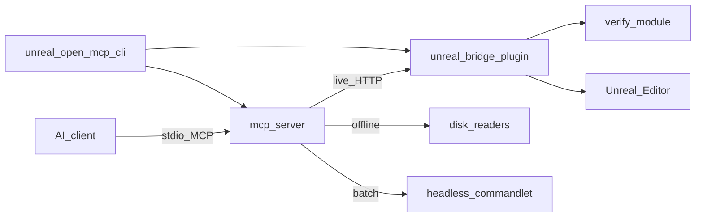

# Architecture

Unreal Open MCP has four runtime parts:

- **Unreal project** with bridge and verify plugins installed (`Plugins/UnrealOpenMCP/`).
- **Bridge** — C++ Editor module, loopback HTTP, game-thread dispatch.
- **MCP server** — TypeScript stdio server, tool registry, routing.
- **CLI** — install, setup-mcp, open, wait-for-ready.

A desktop **Hub** app for guided setup is planned but deferred.

## Repository map

- `mcp-server/` — MCP stdio server, tool registry, routing.
- `packages/bridge/` — Unreal HTTP bridge and typed tool handlers (shipped as `Plugins/UnrealOpenMCP/`).
- `packages/verify/` — validation rules and fixes used by gate flows (standalone; bridge depends on verify).
- `cli/` — `unreal-open-mcp-cli` command-line tooling.
- `skills/` — agent playbooks (`SKILL.md`).
- `demo/` — minimal Unreal C++ demo project with fixtures.
- `scripts/` — version sync and maintenance scripts.

## Runtime flow

1. AI client calls an MCP tool.
2. MCP server chooses route policy.
3. Call goes to:
   - live bridge (preferred), or
   - offline/local readers (supported tools), or
   - local-only handlers (capabilities, manage_tools).
4. Response includes route metadata.



## Route types

- `live` — Unreal Editor bridge is running and reachable.
- `offline` — disk readers for selected project/source operations (no editor required).
- `local` — no Unreal call required (catalog-style operations).
- `batch` — headless Unreal commandlet for supported read/compile operations (planned; narrower than Unity batch).

## Unreal-specific constraints

- Editor bridge is a **C++ Editor module** — no in-process .NET MCP host.
- All UObject / editor API calls run on the **game thread** via a dispatcher.
- Content paths use `/Game/...` and `/Engine/...`; C++ source is jailed to `<Project>/Source/`.
- v1 targets **UE 5.6+**; develop and CI against **UE 5.8**.
- Do **not** pin `EngineVersion` in `UnrealOpenMCP.uplugin` — document the floor in docs/CI only.

## Editor / Runtime boundary

Unreal separates editor and runtime modules at compile time:

- `UnrealOpenMcpEditor` — editor-only (HTTP bridge, tool handlers, gate wiring).
- `UnrealOpenMcpRuntime` — shared infra that may ship in packaged builds when explicitly opted in.
- `UnrealOpenMcpVerify` — editor-only health checks.

The load-bearing invariant is one-directional: **Editor code may reference Runtime code; Runtime code may NEVER reference Editor code.**

## Plugin layout

The bridge is authored under `packages/bridge/` and installed into an Unreal project as `Plugins/UnrealOpenMCP/`:

```
packages/bridge/
  UnrealOpenMCP.uplugin          # plugin descriptor (no EngineVersion pin, ADR-008)
  Source/
    UnrealOpenMcpRuntime/        # Runtime module — shared types: log category, game-thread
                                  # dispatcher, SHA-256, instance-port resolver
    UnrealOpenMcpEditor/         # Editor module — bridge lifecycle, HTTP server, instance lock,
                                  # tool handlers
    UnrealOpenMcpEditorTests/    # Automation specs (editor test runner; not packaged)
```

The Editor module owns bridge boot/shutdown via `IModuleInterface` and logs a proof-of-life line on startup. It also owns the `FUnrealOpenMcpGameThreadDispatcher` lifecycle — the single marshaling path for all UObject / editor API access; every tool body routes through it so HTTP listener worker threads never call editor APIs directly. The dispatcher itself lives in the Runtime module (packaging-safe); the Editor module only starts/stops it. The bridge version advertised to MCP clients lives in `UnrealOpenMcpBridgeSession.h` and is synced from `version.json` by `scripts/sync-version.mjs`.

The Editor module also owns the loopback HTTP bridge (`FUnrealOpenMcpBridgeHttpServer`) — an `FRunnable` that runs the accept loop on its own thread and serves `GET /ping` as a readiness probe. The listener binds `127.0.0.1` only (no remote bind surface); every `/ping` body is marshaled through the game-thread dispatcher so the HTTP worker never touches UObject / editor APIs. See [API / Bridge HTTP](api/bridge-http.md) for the endpoint contract.

## Multi-instance port + discovery

Multiple Unreal projects can run bridges simultaneously without port collisions. The bridge port is **deterministic per project**: `20000 + (sha256(normalizedProjectPath) % 10000)`, where the hash uses the first 8 bytes of SHA-256 as a big-endian `UInt64` so the C++ bridge and the TypeScript MCP server agree byte-for-byte. Path normalization (forward slashes, no trailing slash, case preserved) is applied before hashing. Port resolution precedence:

1. `UNREAL_OPEN_MCP_BRIDGE_PORT` env var (when a valid `1..65535` value)
2. `-UNREAL_OPEN_MCP_BRIDGE_PORT=<n>` CLI arg
3. deterministic hash fallback

The formula and normalization live in `FUnrealOpenMcpInstancePortResolver` (Runtime module, packaging-safe) so a future packaged commandlet can derive its port without editor code. The SHA-256 implementation is a self-contained FIPS 180-4 port (`FUnrealOpenMcpSha256`) — `FSHA1` is SHA-1 and MUST NOT be used; the self-contained impl guarantees byte-for-byte parity with Node `crypto.createHash('sha256')`.

Each running bridge owns a lock file at `~/.unreal-open-mcp/instances/<sha256(projectPath)>.json` (written by `FUnrealOpenMcpBridgeInstanceLock` in the Editor module) carrying: `pid`, `port`, `projectPath`, `projectHash`, `startedAt`, `updatedAt`, `heartbeatAt`, `state`, `isPlaying`, `isCompiling`, `bridgeVersion`, `unrealVersion`. The MCP server reads these to discover the right port per project without an HTTP round-trip. Stale locks (from a crashed editor) are swept on the next `Acquire` by PID-liveness (`FPlatformProcess::GetProcessIsAlive`); the MCP server is read-only on the lock.

> **`authToken` note:** the bearer-token field is deferred to a later phase. It is omitted from the lock JSON today; its absence is pinned in the specs.

## Versioning

The repo tracks a shared version for the npm MCP server, bridge plugin, and verify module from `version.json`. Generated version strings are synced by `scripts/sync-version.mjs`.

## Related docs

- [API index](api.md)
- [Porting principles](porting-principles.md)
- Detailed API docs (TBD): `api/mcp-tools.md`, `api/bridge-http.md`, `api/resources.md`
