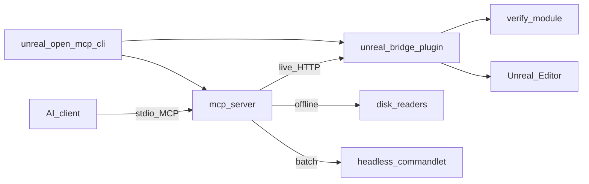

# Architecture

Unreal Open MCP has four runtime parts:

- **Unreal project** with bridge and verify plugins installed (`Plugins/UnrealOpenMCP/`).
- **Bridge** — C++ Editor module, loopback HTTP, game-thread dispatch.
- **MCP server** — TypeScript stdio server, tool registry, routing.
- **CLI** — install, setup-mcp, open, wait-for-ready.

A desktop **Hub** app for guided setup is planned but deferred.

## Repository map

- `mcp-server/` — MCP stdio server, tool registry, routing.
- `packages/bridge/` — Unreal HTTP bridge and typed tool handlers (shipped as `Plugins/UnrealOpenMCP/`).
- `packages/verify/` — validation rules and fixes used by gate flows (standalone; bridge depends on verify).
- `cli/` — `unreal-open-mcp-cli` command-line tooling.
- `skills/` — agent playbooks (`SKILL.md`).
- `demo/` — minimal Unreal C++ demo project with fixtures.
- `scripts/` — version sync and maintenance scripts.

## Runtime flow

1. AI client calls an MCP tool.
2. MCP server resolves the tool in the registry and dispatches it.
3. Call goes to:
   - the live bridge via `LiveClient` — `unreal_open_mcp_ping` routes to `GET /ping`; every other tool routes to `POST /tools/{name}` (the first typed tool, `unreal_open_mcp_actor_find`, shipped in P2.2), or
   - offline/local readers (supported tools, planned), or
   - local-only handlers (capabilities, manage_tools, planned).
4. Response is a structured MCP `CallToolResult`; live errors are classified into `bridge_offline` / `bridge_timeout` / `bridge_http_error` so callers can branch on cause.


```mermaid
flowchart LR
  AIClient[AI_client] -->|stdio_MCP| McpServer[mcp_server]
  McpServer -->|live_HTTP| Bridge[unreal_bridge_plugin]
  McpServer -->|offline| DiskReaders[disk_readers]
  McpServer -->|batch| Commandlet[headless_commandlet]
  Bridge --> Verify[verify_module]
  Bridge --> UEEditor[Unreal_Editor]
  Cli[unreal_open_mcp_cli] --> McpServer
  Cli --> Bridge
```

## Route types

- `live` — Unreal Editor bridge is running and reachable.
- `offline` — disk readers for selected project/source operations (no editor required).
- `local` — no Unreal call required (catalog-style operations).
- `batch` — headless Unreal commandlet for supported read/compile operations (planned; narrower than Unity batch).

## Unreal-specific constraints

- Editor bridge is a **C++ Editor module** — no in-process .NET MCP host.
- All UObject / editor API calls run on the **game thread** via a dispatcher.
- Content paths use `/Game/...` and `/Engine/...`; C++ source is jailed to `<Project>/Source/`.
- v1 targets **UE 5.6+**; develop and CI against **UE 5.8**.
- Do **not** pin `EngineVersion` in `UnrealOpenMCP.uplugin` — document the floor in docs/CI only.

## Editor / Runtime boundary

Unreal separates editor and runtime modules at compile time:

- `UnrealOpenMcpEditor` — editor-only (HTTP bridge, tool handlers, gate wiring).
- `UnrealOpenMcpRuntime` — shared infra that may ship in packaged builds when explicitly opted in.
- `UnrealOpenMcpVerify` — editor-only health checks.

The load-bearing invariant is one-directional: **Editor code may reference Runtime code; Runtime code may NEVER reference Editor code.** ModuleRules enforce linking; the include/surface leak (e.g. a stray `#include "UnrealEd.h"` or an editor-only `Build.cs` dependency) is enforced by `scripts/check-editor-boundary.py`, which runs as a blocking CI guard (`editor-boundary` job). See `packages/bridge/AGENTS.md` for the run command and suppression policy.

## Verify module

`packages/verify/` is a standalone Editor plugin (`UnrealOpenMCPVerify.uplugin`) that owns the rule and fix contracts the gate flow (checkpoint → mutate → validate → delta) dispatches into. The load-bearing invariant is the reverse of the bridge's Editor→Runtime rule: **the bridge depends on verify; verify never depends on the bridge.** The `UnrealOpenMcpVerify.Build.cs` deliberately lists no `UnrealOpenMcp*` dependencies — verify must stay usable standalone so the MCP-side offline scanner can read its issue codes without a live editor, and so the gate (P3.5) can soft/hard-depend on it from the bridge.

```
packages/verify/
  UnrealOpenMCPVerify.uplugin        # plugin descriptor — standalone (no bridge dep)
  Source/
    UnrealOpenMcpVerify/             # Editor module — verify contracts + runner
      Public/Core/                   # EVerifySeverity, EVerifyRunMode, FVerifyScope,
                                     # FVerifyIssue, FIssueKey, IVerifyRule,
                                     # FVerifyResult, FCheckpointFingerprint, FVerifyRunner
      Public/Fixes/                  # FFixDescription, FFixResult, FFixCandidate,
                                     # IFixProvider, FFixProviderRegistry
    UnrealOpenMcpVerifyTests/        # Automation specs (WITH_DEV_AUTOMATION_TESTS-guarded)
```

The contract surface mirrors Unity Open MCP's `packages/verify/Editor/Core/` + `Editor/Fixes/` at copy fidelity. The runner (`FVerifyRunner`) is a static class with idempotent `EnsureDefaultsRegistered()` called from the verify module's `StartupModule` and from the bridge gate boot — so a standalone editor and a bridge-driven path converge on the same registered rule set. The fix registry (`FFixProviderRegistry`) resolves providers deterministically and reports the `Safe` flag accurately (taken from `Describe()`, defaulting to **unsafe** on a throw so the gate never auto-applies something it cannot reason about). The scaffold ships the contracts, runner shell, and fix registry only; concrete rule scanners and fix providers register into the same surfaces as they land.

## Plugin layout

The bridge is authored under `packages/bridge/` and installed into an Unreal project as `Plugins/UnrealOpenMCP/`:

```
packages/bridge/
  UnrealOpenMCP.uplugin          # plugin descriptor (no EngineVersion pin, ADR-008)
  Source/
    UnrealOpenMcpRuntime/        # Runtime module — shared types: log category, game-thread
                                  # dispatcher, SHA-256, instance-port resolver
    UnrealOpenMcpEditor/         # Editor module — bridge lifecycle, HTTP server, instance lock,
                                  # tool handlers
    UnrealOpenMcpEditorTests/    # Automation specs (editor test runner; not packaged)
```

The Editor module owns bridge boot/shutdown via `IModuleInterface` and logs a proof-of-life line on startup. It also owns the `FUnrealOpenMcpGameThreadDispatcher` lifecycle — the single marshaling path for all UObject / editor API access; every tool body routes through it so HTTP listener worker threads never call editor APIs directly. The dispatcher itself lives in the Runtime module (packaging-safe); the Editor module only starts/stops it. The bridge version advertised to MCP clients lives in `UnrealOpenMcpBridgeSession.h` and is synced from `version.json` by `scripts/sync-version.mjs`.

The Editor module also owns the loopback HTTP bridge (`FUnrealOpenMcpBridgeHttpServer`) — an `FRunnable` that runs the accept loop on its own thread and serves `GET /ping` as a readiness probe. The listener binds `127.0.0.1` by default; a remote bind (`0.0.0.0`) is opt-in via project settings and requires `authMode: "required"`. A bearer auth gate runs on every endpoint when `authMode` is `"required"` (the per-session token is minted into the instance lock). Every `/ping` body is marshaled through the game-thread dispatcher so the HTTP worker never touches UObject / editor APIs. See [API / Bridge HTTP](api/bridge-http.md) for the endpoint contract.

## Multi-instance port + discovery

Multiple Unreal projects can run bridges simultaneously without port collisions. The bridge port is **deterministic per project**: `20000 + (sha256(normalizedProjectPath) % 10000)`, where the hash uses the first 8 bytes of SHA-256 as a big-endian `UInt64` so the C++ bridge and the TypeScript MCP server agree byte-for-byte. Path normalization (forward slashes, no trailing slash, case preserved) is applied before hashing. Port resolution precedence:

1. `UNREAL_OPEN_MCP_BRIDGE_PORT` env var (when a valid `1..65535` value)
2. `-UNREAL_OPEN_MCP_BRIDGE_PORT=<n>` CLI arg
3. deterministic hash fallback

The formula and normalization live in `FUnrealOpenMcpInstancePortResolver` (Runtime module, packaging-safe) so a future packaged commandlet can derive its port without editor code. The SHA-256 implementation is a self-contained FIPS 180-4 port (`FUnrealOpenMcpSha256`) — `FSHA1` is SHA-1 and MUST NOT be used; the self-contained impl guarantees byte-for-byte parity with Node `crypto.createHash('sha256')`.

Each running bridge owns a lock file at `~/.unreal-open-mcp/instances/<sha256(projectPath)>.json` (written by `FUnrealOpenMcpBridgeInstanceLock` in the Editor module) carrying: `pid`, `port`, `authToken`, `projectPath`, `projectHash`, `startedAt`, `updatedAt`, `heartbeatAt`, `state`, `isPlaying`, `isCompiling`, `bridgeVersion`, `unrealVersion`. The MCP server reads these to discover the right port per project without an HTTP round-trip. Stale locks (from a crashed editor) are swept on the next `Acquire` by PID-liveness (`FPlatformProcess::GetProcessIsAlive`); the MCP server is read-only on the lock.

> **`authToken`:** the per-session bearer token minted on bridge start (64-char lowercase hex, 256 bits). The MCP server auto-discovers it via `resolveAuthToken` and attaches `Authorization: Bearer <token>` to every request. Enforcement is opt-in via `authMode` in `<project>/.unreal-open-mcp/settings.json` (`"none"` default | `"required"`); see [API / Bridge HTTP §Auth](api/bridge-http.md#auth).

## Live routing (MCP → bridge)

The MCP server holds one `LiveClient` per session, installed at startup once the bridge port + auth token are resolved. The client is the single HTTP hop for live-routed tools. It routes `unreal_open_mcp_ping` to the bridge's `GET /ping`, and every other tool to `POST /tools/{name}` where the bridge resolves the handler and returns the canonical `{ok, result, error}` envelope. The first real typed tool — `unreal_open_mcp_actor_find` (read-only actor locator) — shipped in P2.2; the first mutating typed tool — `unreal_open_mcp_actor_create` (spawn in the current editor level, wrapped in `FScopedTransaction`; gate deferred to P3.5) — shipped in P2.3; the reflection-write pair — `unreal_open_mcp_actor_modify` (FProperty writes on actor(s) via a flat `properties` bag, with transform shortcuts routed to the actor transform APIs) and `unreal_open_mcp_object_modify` (FProperty writes on any UObject — actor, component, or asset instance — via `ResolveObject`) — shipped in P2.4. P2.5 completed the actor family: the tree-structure mutators `actor_set_parent` (reparent with an `IsAttachedTo`-based cycle guard), `actor_duplicate` (spawn-from-template clone), and `actor_destroy` (single + batch via `EditorDestroyActor`), plus the five component CRUD tools `actor_component_add` (NewObject + the registration sequence), `actor_component_destroy` (with an instance-component gate), `actor_component_get` (read-only `UStructToJsonObject` dump), `actor_component_modify` (ApplyProperties on a resolved component), and `actor_component_list_all` (read-only components array). P2.6 shipped the level lifecycle family — the Unreal analog of Unity's `scene_*` family: `level_open` (replace the editor world via `LoadMap`, with a package-dirty guard + `ignore_dirty` bypass), `level_save` (save in place or save-as the persistent level), `level_list_loaded` (read-only persistent + streaming sublevel enumeration with path-first identity), `level_set_current` (switch the actor-editing context via `MakeLevelCurrent`), and `level_unload_sublevel` (remove a streaming sublevel via `RemoveLevelFromWorld`, with a persistent-level guard). P2.7 added the level inspect + create pair: `level_get_data` (read-only actor roster of the current editor world or a loaded sublevel, with a token-budget profile compact/balanced/full + `page_size`/`cursor` pagination, and a `worldPartition` + `partitionScope:"loaded-cells-only"` flag so a sparse World-Partition roster is not mistaken for the complete actor set) and `level_create` (new in-memory or saved-to-disk level, optionally template-seeded via `GEditor->NewMap` / `NewMapFromTemplate`, with the same dirty guard as `level_open`). P4.1 added the asset read family: `asset_find` (read-only filtered AssetRegistry query with stable object-path ordering + `offset`/`limit` pagination; an empty filter defaults to `/Game` recursive so a no-arg find never scans `/Engine`) and `asset_get_data` (read-only single-asset metadata by path-or-name, returning `{ name, path, package, class, tags }` with an optional `paths` projection for token savings). P4.2 added the Content Browser CRUD family: `asset_create_folder` (idempotent `MakeDirectory`; refuses `/Engine`/`/Script`/`/Temp`), `asset_copy` (`DuplicateAsset`; destination must not exist), `asset_move` (`RenameAsset`; destination must not exist; a redirector may remain at the source path), `asset_delete` (`DeleteAsset` with a referencer guard — REFUSES with `delete_blocked_by_referencers` listing the inbound referencer packages unless `force:true`), and `asset_refresh` (read-only `IAssetRegistry::ScanPathsSynchronous`; defaults to `/Game`). The four create/copy/move/delete tools are mutating (route live, default gate `enforce`, `paths_hint` required); `asset_refresh` is read-only — `ScanPathsSynchronous` only updates the in-memory registry cache and does not write packages or change the UObject graph, so the gate would have no on-disk diff to checkpoint. P4.3 added the material family: `material_create` (create a `UMaterialInstanceConstant` from a parent `UMaterialInterface` via `UMaterialInstanceConstantFactoryNew` + `IAssetTools::CreateAsset`, with the transient factory GC-rooted across the create; destination must not exist and must live under a writable content root), `material_modify` (batch scalar/vector/texture parameter overrides via `UMaterialEditingLibrary` — unknown names and missing textures are collected in `failed` rather than aborting the call, an empty or all-failed modify is refused with `nothing_to_modify` and leaves the package untouched, and `save:true` opts into writing the package to disk), and `material_get_data` (read-only scalar/vector/texture parameter inventory + current values — the instance override for a material instance, the base-material default for a `UMaterial` — with the shapes aligned to `material_modify` input so get-data output chains into a modify call). `material_create` and `material_modify` are mutating (route live, default gate `enforce`, `paths_hint` required); `material_get_data` is read-only. P4.4 added `asset_import` (bring an absolute host filesystem source file — textures PNG/JPG/TGA/EXR, static meshes FBX/OBJ/glTF, sounds WAV — into a `/Game` content folder via `IAssetTools::ImportAssetTasks`; `replace_existing` / `save` default false; mutating, gate `enforce`, `paths_hint` required). The Blueprint family ships its spine: `blueprint_create` (new Blueprint class from a resolvable parent via `FKismetEditorUtilities::CreateBlueprint` — `path` is the `/Game` package path with the object-path form also accepted and normalised, `parent_class` defaults to `/Script/Engine.Actor` and any Blueprintable parent is allowed when `CanCreateBlueprintOfClass` passes; in-session registration via `AssetRegistry.AssetCreated` + `MarkPackageDirty`, no disk save; an any-`UObject` collision probe turns a non-Blueprint asset at the target path into a structured `asset_already_exists` instead of the engine's fatal "same fully-qualified name, different class" allocation check, and a failed create `MarkAsGarbage`'s the empty package) and `blueprint_get` (read-only scoped graph summary `{ name, path, parentClass, variables, components, functions, events, interfaces, parentChain }`; events carry an `enabled` flag so a fresh Actor Blueprint's pre-seeded DISABLED ghost event nodes are distinguishable from enabled ones). The shared helpers — `ResolveBlueprint` (in-memory first, then load — session-created assets may be unsaved), path normalization, name well-formedness, `BlueprintRef` JSON, and the pin-type reverse map — are the spine every later Blueprint sub-tool (variables, components, graph authoring, compile, spawn) builds on. The Blueprint SCS component pair extends that spine: `blueprint_add_component` (add a node to the Simple Construction Script via the public SCS surface — `USimpleConstructionScript::CreateNode` + `AddChildNode` under an optional scene-component `parent_component`, or `AddNode` for a root; guards reject a non-`UActorComponent` class (`invalid_component_class`), an abstract/deprecated class (`abstract_component` — `CreateNode` -> `NewObject` fatally asserts on e.g. `/Script/Engine.LightComponentBase`, so the `CLASS_Abstract | CLASS_Deprecated | CLASS_NewerVersionExists` check runs first), a name collision across the SCS ↔ member variables ↔ parent-class properties (`name_collision` — those namespaces share the generated class's property namespace and would otherwise only fail at compile), a missing parent (`parent_not_found`), and a non-`USceneComponent` attachment (`invalid_attachment`); `MarkBlueprintAsStructurallyModified` follows so a later compile rebuilds the CDO) and `blueprint_remove_component` (delete a node by variable name via `RemoveNodeAndPromoteChildren` — children re-parented onto the removed node's parent so a subtree is never orphaned). `blueprint_create`, `blueprint_add_component`, and `blueprint_remove_component` are mutating (route live, default gate `enforce`, `paths_hint` required); `blueprint_get` is read-only. The Blueprint variable family extends the spine further: `blueprint_add_variable` (add a typed member variable via `FBlueprintEditorUtils::AddMemberVariable` using the §3.2 pin-type forward map — the forward twin of the `PinTypeToString` reverse map `blueprint_get` uses; `type` accepts a primitive `bool`/`int`/`int64`/`byte`/`float`/`string`/`name`/`text`, a math struct `vector`/`vector2d`/`rotator`/`transform`/`color`, or a resolvable object/struct path; optional `is_array` + `default_value` in UE text format — the default only takes effect after a compile; guards reject cross-namespace name collisions — member-variable names, SCS component names, and inherited parent properties all share the generated class's property namespace (`name_collision`) — and unresolvable type tokens (`invalid_type`)), `blueprint_modify_variable` (rename and/or retype an existing member variable with validate-before-mutate ordering — the rename is validated, well-formed + no collision, BEFORE the retype commits, because `ChangeMemberVariableType` commits immediately and `RenameMemberVariable` is void with no collision check of its own, so a colliding/ill-formed `new_name` would otherwise leave a partial retype; at least one of `new_name`/`new_type` required), and `blueprint_set_default` (write a Class Default Object property via the property's own text importer — `ImportText_Direct` — bracketed with `PreEditChange`/`PostEditChangeProperty` so an open Details panel / property-change observers refresh; changes the CLASS DEFAULT so it affects newly-spawned instances only, not placed actors; compile-first — a member variable added via `blueprint_add_variable` is NOT a property on the generated class until `blueprint_compile` lands it, so `set_default` on such a property reports `property_not_found` with a message pointing at `blueprint_compile`; the expected loop is add → compile → set_default). All three are mutating (route live, default gate `enforce`, `paths_hint` required). The Blueprint function/event STUB pair adds graph entry points: `blueprint_add_function` (create an empty user function-graph stub via `FBlueprintEditorUtils::CreateNewGraph` + `AddFunctionGraph` — the K2 schema auto-wires the entry/result nodes and the MVP stub is parameter-less; the outer-name hijack guard probes `FunctionGraphs` + any `UObject` outered to the Blueprint because `CreateNewGraph` would otherwise resolve a name clash by renaming the EXISTING object aside and silently report success — surfaced as `name_collision`; body authoring is OUT OF SCOPE) and `blueprint_add_event` (enable or create an overridable parent event node — e.g. `ReceiveBeginPlay` / `ReceiveTick` — via the K2 schema's `FunctionCanBePlacedAsEvent` + `FKismetEditorUtilities::AddDefaultEventNode`; the two-pronged resolution mirrors the K2 editor — a fresh Actor event graph is pre-seeded with DISABLED ghost nodes for the common events that are INERT until enabled, so an existing disabled ghost is the node the tool ENABLES (enabling the ghost IS the "add event" op — never a false no-op), an already-enabled node is a real duplicate (`event_already_exists`), and no existing node → `AddDefaultEventNode` mints + the tool enables a fresh one; a `name` that names no parent `UFunction` OR names a non-`BlueprintEvent` function like `K2_DestroyActor` is rejected by the schema check with `not_an_event`; body authoring is OUT OF SCOPE). Both are mutating (route live, default gate `enforce`, `paths_hint` required); they mark the Blueprint structurally modified so a later compile wires the override / lands the function on the generated class. The compile tool closes the structure-edit loop: `blueprint_compile` (compile a Blueprint via `FKismetEditorUtilities::CompileBlueprint` with a silent `FCompilerResultsLog` and return a STRUCTURED error/warning list — `{ succeeded, numErrors, numWarnings, messages[] }` where each message is `{ severity, message, node?, graph? }` with best-effort node/graph attribution from the compiler's `UObject` tokens; the AI feedback loop — a FAILED compile is a NORMAL, expected result, NOT a transport failure: the envelope stays `ok:true` and the result carries `succeeded:false` + the populated `messages[]` so an agent reads the diagnostics, fixes via the structure-edit tools, and recompiles; only tool-level errors — missing path / missing asset / reserved root / malformed body — map to `ok:false`; a non-zero compiler error count rides through as `succeeded:false`). It is mutating (route live, default gate `enforce`, `paths_hint` required) — compile rebuilds the generated class + bytecode and dirties the package; under `enforce` a failed compile may also surface verify `compile_errors` in the `gate` block (desirable — same package, same diagnostics), and `gate:"warn"` / `gate:"off"` keep the `result` flowing for a tight recompile loop. The Source read/list family opens the C++ inspection surface: `source_read` (read a project C++ source file under `<Project>/Source/` with an optional 1-based `start_line`/`end_line` window and a soft `max_lines` cap — default 2000, ceiling 20000 — returning `{ path, total_lines, start_line, end_line, truncated, lines:[{line,text}] }`) and `source_list` (enumerate source files under `<Project>/Source/`, optionally scoped to a `module` folder, with `recursive` default true and an `extensions` allow-list default `.h/.hpp/.c/.cc/.cpp/.cs`, returning `{ root, files:[{path,bytes}], count, total_bytes }`). Both are read-only (route live, gate-free). Every path access is JAILED to `<Project>/Source/` via the shared `ResolveJailedPath` helper — `..` traversal, absolute-outside, and NTFS alternate-data-stream (`:`) escapes return a structured `path_escapes_jail` and never read; a best-effort junction/symlink check re-verifies containment against the on-disk resolved path. The jail targets the PROJECT `Source/`, not `Plugins/UnrealOpenMCP`. The shared jail helpers (`GetProjectSourceRoot`, `ResolveJailedPath`) are the spine every later source sub-plan (CRUD / compile) builds on; there is no offline disk route for source in P7 (that lands in a later phase). The Source CRUD family extends that spine: `source_create_class` (scaffold a header + cpp from parent-kind templates — UObject default / Actor / ActorComponent / None — into an existing module folder; `class_name` is the bare name without the U/A/F prefix, derived from `parent_class`; emits the `<MODULE>_API` dllexport macro + `GENERATED_BODY()`; refuses overwrite unless `force:true`; a failed cpp write rolls back the header), `source_update` (full-file replace or a 1-based inclusive `start_line`/`end_line` line-range splice on an existing file; preserves the detected EOL + trailing newline when splicing so a one-line splice is a one-line diff), and `source_delete` (delete a single file; refuses directories; destructive and NOT undoable from MCP). All three are mutating (route live, default gate `enforce`, `paths_hint` required). The compile tool closes the C++ edit loop: `source_compile` (the AI feedback loop — prefers Live Coding when the editor is interactive + LC is live + `use_live_coding` true, Windows only via the `WITH_UNREAL_MCP_LIVE_CODING` guard; otherwise invokes UnrealBuildTool on the project's Editor target and parses MSVC + clang stdout/stderr into `{ file, line, severity, message }[]` via the exported `ParseDiagnostics`; `success` (return 0) is SPLIT from `compile_clean` (zero compiler errors) — a loaded editor holds its module DLL so a UBT relink fails (`success:false`) even when the compile stage was clean (`compile_clean:true`); key off `compile_clean` + `diagnostics[]`; a FAILED compile is a NORMAL result (`ok:true` + `success:false` + populated `diagnostics[]`), NOT a transport failure — only tool-level errors `invalid_parameter` / `ubt_not_found` / `ubt_launch_failed` map to `ok:false`; `target`/`platform`/`configuration` must be identifier-only tokens, no arg injection). It is mutating (route live, default gate `enforce`, `paths_hint` required) — a compile rebuilds module DLLs + dirties the project; under `enforce` a failed compile may also surface verify `compile_errors` (P3.4) in the `gate` block (desirable — same source, same diagnostics), and `gate:"warn"` / `gate:"off"` keep the `result` flowing for a tight recompile loop.

## Source family + Source/ jail

The source family (`source_read`, `source_list`, `source_create_class`, `source_update`, `source_delete`, `source_compile`) is the C++ surface for project code under `<Project>/Source/`. It is distinct from the asset family (`/Game` content via the AssetRegistry) and from the plugin's own source under `Plugins/UnrealOpenMCP/Source/` — the jail is the loaded project's `Source/` only. The jail contract (`ResolveJailedPath`) and the diagnostic parser (`ParseDiagnostics`) are exported from `UnrealOpenMcpSourceTools` so the Automation specs drive them directly with an injectable temp root / canned build output (no live editor, no UBT invocation required); every mutating source tool (create / update / delete / compile) reuses the same jail so a path that escapes is rejected before any file op runs.

`source_compile` closes the C++ edit loop with a structured diagnostic report — the AI feedback loop. It prefers Live Coding when the editor is interactive + LC is live + `use_live_coding` is true (Windows only — the `LiveCoding` engine module is gated by `WITH_UNREAL_MCP_LIVE_CODING`; patches the running module DLL in place, no relink), otherwise invokes UnrealBuildTool on the project's Editor target and parses MSVC + clang stdout/stderr into `{ file, line, severity, message }[]`. `success` (process return 0) is SPLIT from `compile_clean` (zero compiler errors): a loaded editor holds its module DLL, so a UBT relink fails to write it (`success:false`) even when the compile stage was clean (`compile_clean:true`) — compiler errors are emitted before the link stage, so they are unaffected by the lock and the AI loop keys off them. A FAILED compile is a NORMAL result (`ok:true` + `success:false` + populated `diagnostics[]`), NOT a transport failure — mirroring `blueprint_compile`'s failed-compile-as-data contract. Only tool-level errors (`invalid_parameter` / `ubt_not_found` / `ubt_launch_failed`) map to `ok:false`. There is no offline disk route for source in this phase (that lands in a later phase).

Failure classification is the load-bearing contract — an agent (or a human reading the result) must be able to tell *why* a ping failed:

| Code | Cause |
|---|---|
| `bridge_offline` | No listener on the resolved port (ECONNREFUSED / DNS / socket reset before connect). The editor is not running, or the bridge is on a different port. The error message names this project's instance lock path. |
| `bridge_timeout` | The listener accepted the connection but did not respond within the timeout (AbortController fired). The editor may be blocked (modal, heavy compile) or the game-thread dispatcher stalled. |
| `bridge_http_error` | The bridge responded with an unexpected HTTP status (5xx / 4xx other than the documented 503). A 503 ("not ready") surfaces the bridge's fallback body here so the caller sees `connected:false` / `not_ready`. |
| `bridge_response_unparsable` | The bridge returned HTTP 200 but the body was not valid JSON (e.g. the socket was torn down mid-response). |

## E2E smoke verification

Two layers guard the MCP ↔ bridge route. Use both when changing transport, discovery, or tool routing:

1. **In-process integration tests** — `mcp-server/src/integration.test.ts` (`npm test`). Wires a real MCP SDK `Client` to `createServer()` over an in-memory transport, with the live router pointed at a `LiveClient` aimed at a loopback HTTP stub.
2. **Scripted stdio smoke** — `mcp-server/scripts/*-parity-smoke.mjs` (`npm run smoke:p1` / `smoke:p2` / `smoke:p4` / `smoke:p6`). Spawns the built `dist/index.js` and drives `initialize → tools/list → tools/call …` over stdio. This catches packaging, transport, and instance-discovery wiring drift the in-process suite cannot see. Pass `--port <n> --project <path>` to run the healthy case against a live Unreal Editor (bridge-down, tool-error, and compile-failed cases require the stub harness and are skipped in `--port` mode).

### Ping route

```
stdio MCP client  →  unreal_open_mcp_ping  →  GET /ping  →  bridge health payload
```

Pinned outcomes: healthy (200 PingResponse body survives the round-trip verbatim), bridge-down (`bridge_offline` + the instance-lock hint), and HTTP 500 (`bridge_http_error` carrying the bridge's own error body). Stdio smoke: `mcp-server/scripts/p1-parity-smoke.mjs`.

When the smoke (or a real ping) fails, the code / symptom points at the owner area:

| Code / symptom | Likely cause | Owner area |
|---|---|---|
| `bridge_offline` | Editor down / wrong port / stale instance lock | Instance discovery + lock (Runtime resolver, Editor lock writer, TS discovery) |
| `bridge_timeout` | Game thread blocked / hung handler | Game-thread dispatcher + HTTP server |
| `bridge_http_error` | Unexpected HTTP status (5xx / non-503 4xx) / server bug | Bridge HTTP server |
| `bridge_response_unparsable` | HTTP 200 with a non-JSON body (socket torn down mid-response) | Bridge HTTP server |
| Wrong port / empty ping body | Port-formula drift (C++ resolver vs TS discovery hashing/normalization) | Runtime port resolver + TS instance-discovery |
| Plugin won't load | `.uplugin` / module `Build.cs` mis-wired | Plugin scaffold + module structure |
| CI boundary failure | Editor-only API referenced from Runtime code | Editor/Runtime boundary guard |

### Typed-tool route (`actor_find`)

```
stdio MCP client  →  unreal_open_mcp_actor_find  →  POST /tools/unreal_open_mcp_actor_find
                  →  {ok, result, error} envelope  →  unwrapped result body
```

The loopback stub dispatches `GET /ping` and `POST /tools/unreal_open_mcp_actor_find`. Pinned outcomes: healthy (the INNER `result` body survives the round-trip verbatim — `LiveClient.postTool` unwraps the envelope), bridge-down (`bridge_offline` with the instance-lock hint), and tool-error (`{ok:false, error:{code,message}}` surfaces as an MCP error carrying the tool-specific code). Stdio smoke: `mcp-server/scripts/p2-parity-smoke.mjs`.

The ping failure codes classify identically on `POST /tools/{name}`. The typed-tool path adds the `{ok:false, error:{code,message}}` envelope for structured handler failures (e.g. `actor_not_found`, `invalid_parameter`, `no_editor_world`), which surface verbatim on the MCP `CallToolResult`.

| Code | Owner area | Likely cause |
|---|---|---|
| `bridge_offline` | instance discovery / editor not running | UE closed, wrong port (same owner as the `/ping` path) |
| `bridge_timeout` | bridge / game thread | Editor blocked (modal, heavy compile) |
| `bridge_http_error` | HTTP transport | Unexpected status (404 tool_not_found, 405 method_not_allowed, 500 bridge_internal_error) |
| `tool_not_found` | bridge tool registry | Tool not registered with the bridge dispatch |
| `tool_not_routed` | MCP LiveClient | `postTool` not wired for this tool name |
| `actor_not_found` | actor-find handler | Bad actor ref / no editor world / no match |
| tool-specific (`invalid_parameter`, `no_editor_world`, …) | the tool handler that emitted it | See the tool's documented error codes |

### Asset-family route (`asset_find`)

```
stdio MCP client  →  unreal_open_mcp_asset_find  →  POST /tools/unreal_open_mcp_asset_find
                  →  {ok, result, error} envelope  →  unwrapped result body
```

`asset_find` is the smoke default because it is read-only (gate-free): it proves the wiring without a checkpoint → mutate → delta dance. (`material_create` is a mutator alternate if a write round-trip is preferred; it would carry a `paths_hint` in the tools/call args.)

Pinned outcomes: healthy (the INNER `{total, offset, count, assets}` pagination envelope with an `AssetSummary` of `{name, path, package, class}` survives the round-trip verbatim), bridge-down (`bridge_offline` with the instance-lock hint), and tool-error (`invalid_class_path`). Stdio smoke: `mcp-server/scripts/p4-parity-smoke.mjs`. Transport failure codes match the typed-tool table; tool-specific codes for `asset_find` include `invalid_class_path` / `invalid_parameter` / `missing_parameter`.

| Failure signature | Likely owner |
|---|---|
| `tools/list` missing `asset_find` | MCP `tools/index.ts` registration |
| Stub `POST` never hit | `live-client` routing / tool name mismatch |
| `bridge_offline` on a healthy stub | discovery / port / lock-path regression |
| Envelope unwrap error | `live-client` result parsing |
| Live-editor find empty under `/Game` | bridge AssetRegistry handler / content not scanned |

### Blueprint compile-loop route (`blueprint_spawn` + `blueprint_compile`)

```
stdio MCP client  →  unreal_open_mcp_blueprint_spawn  →  POST /tools/unreal_open_mcp_blueprint_spawn
                  →  {ok, result, error} envelope  →  unwrapped result body
```

`blueprint_spawn` is the smoke default because it closes the create → edit → compile → spawn loop (the phase-gate for the Blueprint family). It is a mutator, so the tools/call args carry a `paths_hint`. Four cases are pinned (the four the `smoke:p6` acceptance criteria call out as load-bearing): healthy spawn (the INNER `{actor, name, class, path, location}` identity survives the round-trip verbatim), bridge-down (`bridge_offline` with the instance-lock hint), tool-error (`not_compiled` — an uncompiled Blueprint, the structured code an agent branches on to run `blueprint_compile`), and **compile-failed = data** — `blueprint_compile` returns `succeeded:false` on an `ok:true` envelope, so MCP `isError` stays `false` and the diagnostics ride through as data (the contract that lets an agent treat "compile failed" as data, not an opaque error). Stdio smoke: `mcp-server/scripts/p6-parity-smoke.mjs`. Transport failure codes match the typed-tool table; tool-specific codes for `blueprint_spawn` include `not_compiled` / `not_actor_blueprint` / `no_editor_world` / `spawn_failed` / `blueprint_not_found` / `missing_parameter` / `invalid_parameter`.

| Failure signature | Likely owner |
|---|---|
| `tools/list` missing `blueprint_spawn` | MCP `tools/index.ts` registration |
| `isError:true` on a `succeeded:false` compile | envelope contract regression (a failed compile is data, not a transport error) — `live-client` / bridge compile handler |
| `not_compiled` ignored by an agent | tool-description regression (`blueprint-spawn.ts` must point at `blueprint_compile`) |
| `spawn_failed` under `-nullrhi` | bridge spawn handler used the viewport-aware editor subsystem instead of `UWorld::SpawnActor` (headless-safe path) |
| Live-editor spawn null after compile | bridge spawn handler resolved a stale `GeneratedClass`; re-run `blueprint_compile` |

## Versioning

The repo tracks a shared version for the npm MCP server, bridge plugin, and verify module from `version.json`. Generated version strings are synced by `scripts/sync-version.mjs`.

## Related docs

- [API index](api.md)
- [Porting principles](porting-principles.md)
- Detailed API docs (TBD): `api/mcp-tools.md`, `api/bridge-http.md`, `api/resources.md`
